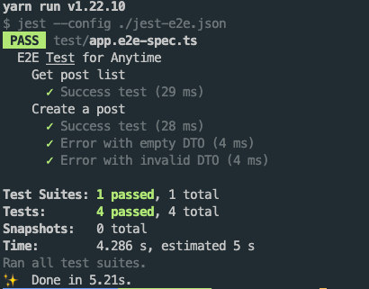

# Anytime

This project is an anonymous posting & survey service that is completely unsafe. so, don't care about security.

## Prerequisites

- PostgreSQL
  - If you are using a docker, get the latest version of PostgreSQL.
  - then run `make db` (should have `makefile`) or run script
    ```sh
    docker container run -it --name anytime-db --rm \
      -e POSTGRES_PASSWORD=postgres \
      -e POSTGRES_DB=anytime \
      -p 5432:5432 \
      postgres:latest
    ```
  - If you don't use docker, then run the database in your local machine.
    - The application may need to change the setting for the connection. Set username, password, database.
- Node 14.x or latest
- [yarn](https://yarnpkg.com/getting-started)


```sh
yarn

&

yarn dev
```

## Current state

The contents developed so far are as follows.

- `POST /api/posts` - Create a post
- `GET /api/posts` - Show all posts

## Directory architecture

While this architecture does not need to be kept in development, those unfamiliar with the NestJS project should follow it.

```
src/
  api/                  ... api module
    post/               ... module for api (post)
  schemas/postgresql/
    post.schema.ts      ... post schema (ORM table definition)
  app.module.ts         ... top-level application builder
  main.ts               ... entry point
test/                   ... E2E test codes
...
```

## E2E Test

### Prerequisites

- Running database

### Run

```sh
yarn test:e2e
```



--- 

## Assignment

Features that should be developed

- **Create a survey.**
  - Define new schema for this service. Do not use `post` table.
  - Work with `POST /api/surveys` endpoint.
  - Body should take
  
  |   field    |    type    |                       description                       |
  | :--------: | :--------: | :-----------------------------------------------------: |
  |   author   |   string   |               author who creates the vote               |
  |   title    |   string   |                          title                          |
  | surveyType | SurveyType |              one of SurveyType enum value               |
  | expiredAt  |   number   | unix time stamp (seconds) & nullable & default is 1 day |
  |  content   |   Survey   |                     survey content                      |
    
  - `SurveyType`
  ```ts
  type SurveyType = "choice" | "short";
  // choice for multiple choice, short for short answer.
  ```

  - `Survey`
  ```ts
  type Survey = ChoiceSurvey | ShortSurvey;

  type ChoiceSurvey = Array<string>;
  type ShortSurvery = {
    length: number; // less than 1 << 31, more than 1
  }
  ```
  > `SurveyType` & `Survey` is just type for client. Those have nothing to do with schema.

  - API should return:
  ```ts
  interface SuccessResponse {
    result: {
      id: number; // id for survey;
      title: string;
      expiredAt: number;
      createdAt: number; // Unix timestamp (seconds)
    }
  }
  ```
- **Answer.**
  - Work with `POST /api/surveys/{surveyId}` endpoint.
  - Body should take
  
  |  field   |       type       |                  description                   |
  | :------: | :--------------: | :--------------------------------------------: |
  |  answer  | number or string | number for choice type & string for short type |
  | username |      string      |                    username                    |

  - Client can answer only for non-expired survey.
  - Only one answer is allowed per username.
  - API should return:
  ```ts
  interface SuccessResponse {
    result: true
  }
  ```
  
- **Show the result.**
  - Work with `GET /api/surveys/{surveyId}` endpoint.
  - Should provide username to server, but do not use querystring (`?username=something`).
    - use cookie or header (custom or authorization)
    - Result is only for author.
  - API should return:
  ```ts
  interface SuccessResponse {
    result: {
      id: number;
      title: string;
      surveyType: SurveyType;
      isExpired: boolean;
      survey: ChoiceResult | ShortResult; // depending on surveyType
    }
  }

  type ChoiceResult = Array<{
    choice: string;
    users: Array<string>; // username list who select this choice
  }>

  type ShortResult = Array<{
    answer: string;
    user: username
  }>
  ```
> All error responses are same.
> ```ts
> interface ErrorResponse {
>   statusCode: number;
>   message: string | Array<string>; // List of string or string (detail)
>   error: string; // Error code or simple message
> }
> ```
> And response status code should be 400

### Reference

API

- [Typescript](https://www.typescriptlang.org/docs/handbook/intro.html)
- [NestJS](https://docs.nestjs.com/)
- [TypeORM](https://typeorm.io/)

E2E test framework

- [supertest](https://github.com/visionmedia/supertest)
- [jest](https://jestjs.io/)

And, this project use PostgreSQL.

### NOTICE

You can change some tech stacks but you should,

- Make test codes & pass those.
- use RDBMS.

### SUBMIT

- Upload your code on public repository. (Github or anything else) & link
- Snapshot for E2E test code results.
  - Every API should have >= 3 test cases.
  - Don't make each DTO field a test case.
    - ex. `Error with invalid field1`, `Error with invalid field2` ...  